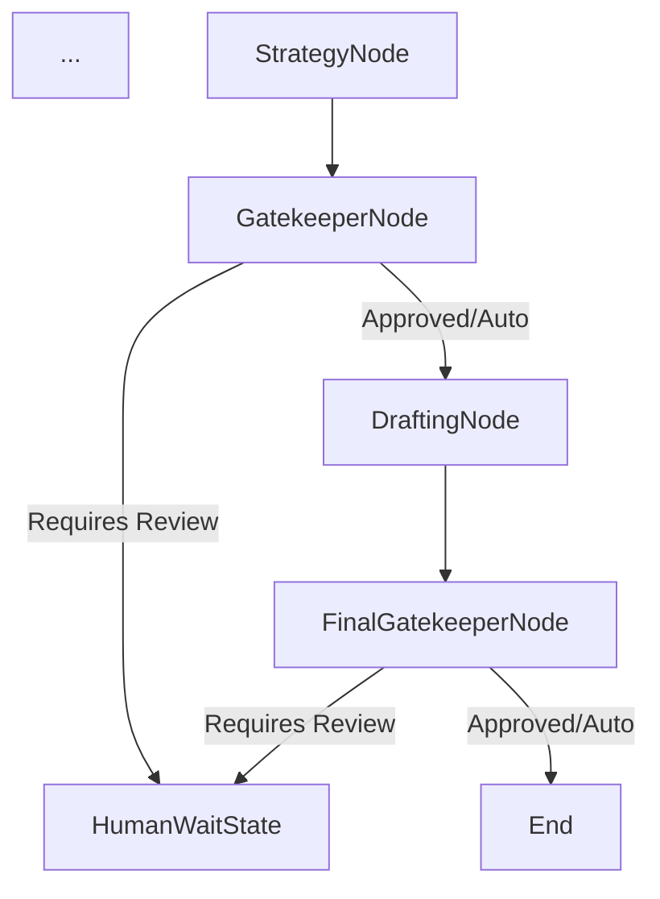

# Phase 4.1: Human-in-the-Loop (HITL) Protocol

To ensure trust and safety, the system implements a variable-autonomy protocol. This allows the organization to scale from "Copilot" (Strict) to "Agent" (Autonomous) modes.

## 1. Agency Levels

We define an enum `AgencyLevel` in the configuration:

| Level | Description | Interruption Points |
| :--- | :--- | :--- |
| **STRICT** | Human vets every AI thought. | 1. After Analysis (Interpretation)<br>2. After Strategy (Decision)<br>3. After Drafting (Output) |
| **MEDIUM** | Human verifies major checkpoints. | 1. After Strategy (Proposed Plan)<br>2. After Drafting (Before sending) |
| **AUTONOMOUS** | AI runs free unless requested. | 1. Only if Supplier specifically asks for a human.<br>2. (Safety) If Confidence Score < Threshold. |

## 2. LangGraph Implementation Strategy

LangGraph supports persistence (checkpoints). We will use `workflow.interrupt_before` dynamically based on the configured Agency Level.

### 2.1 State Updates
We add specific flags to `NegotiationState`:
```python
class NegotiationState(TypedDict):
    ...
    agency_level: str # STRICT, MEDIUM, AUTONOMOUS
    human_approval_status: str # PENDING, APPROVED, REJECTED
    stop_reason: str # "AGENCY_CHECK", "SUPPLIER_REQUEST", "LOW_CONFIDENCE"
```

### 2.2 The "Human Node" vs. Checkpoints
Use **LangGraph Checkpoints**. When the graph hits an interruption point, it effectively "pauses" and saves state to the database.
The API will return `status: "paused"`.
The Frontend will display the current state (e.g., the Draft).
The Human sends a `POST /resume` with `action: "APPROVE"` or `feedback: "Rewrite this..."`.

**Graph Topology changes**:
We don't need *new nodes* necessarily, but rather *conditional edges* that route to a `End` state early if approval is required, OR we use the native `interrupt_before` feature of LangGraph compilation.

**Better Approach for Dynamic Agency**:
Since `interrupt_before` is set at compilation time, we might build a `HumanReviewNode` that acts as a gatekeeper.

**New Flow**:


### 3. Implementation Steps

1.  **Configuration**: Add `AGENCY_LEVEL` to settings.
2.  **State Update**: Update `NegotiationState`.
3.  **Gatekeeper Node**: Create a node `human_review_node` that checks the `agency_level` and the current step.
    *   If review needed: It sets `human_approval_status = "PENDING"` and returns `Command(goto=END)` or creates a loop waiting for input.
    *   Actually, effectively in LangGraph, we just return. The state is saved. The next API call resumes it.
4.  **Resume Endpoint**: `POST /agent/negotiate/{thread_id}/resume`.

## 4. Specific Logic per Level

### Strict
*   **Gate 1 (Interpretation)**: After `Lawyer` + `Analyst`. "Here is what I found. OK?"
*   **Gate 2 (Strategy)**: "I plan to Reject. OK?"
*   **Gate 3 (Draft)**: "Here is the email text. OK?"

### Medium (Default)
*   **Gate 1**: Skipped (Trusted Analysis).
*   **Gate 2 (Strategy)**: "I interpret this as a policy violation and plan to Counter. OK?"
*   **Gate 3 (Draft)**: "Ready to send. OK?"

### Autonomous
*   **Logic**: Check `last_message` content. If it contains "escalate", "manager", "human", then Trigger Gate. Else -> **Auto-Send**.
