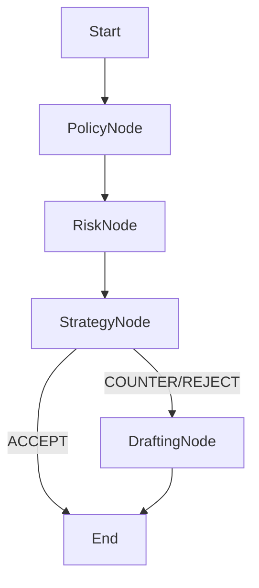

# Phase 4: Agent Core - LangGraph Orchestration

## Goal
To wire the disparate capabilities (Lawyer, Analyst, Scribe) into a cohesive, stateful negotiation workflow using **LangGraph**. This "Agent Core" will act as the brain of the SCRMWRM.

## 1. Architecture: The Negotiation State Graph

We will model the negotiation process as a Directed Cyclic Graph (DCG).

### 1.1 The State (`NegotiationState`)
This shared state object is passed between all agents.

```python
class NegotiationState(TypedDict):
    contract_id: UUID
    supplier_id: UUID
    current_clause_text: str  # The specific text under review
    
    # Context (Populated by Agents)
    policy_analysis: Optional[EvaluationResult] # From Lawyer
    risk_profile: Optional[SupplierRiskProfile] # From Analyst
    
    # Chat History
    messages: List[LLMMessage]
    
    # Decisions
    strategy_decision: str # "ACCEPT", "REJECT", "COUNTER"
    proposed_redline: Optional[str]
```

### 1.2 The Nodes (Agents)

1.  **`PolicyNode` ("The Lawyer")**
    *   **Input**: `current_clause_text`
    *   **Action**: Calls `PolicyEvaluator.evaluate`.
    *   **Output**: Updates `policy_analysis` in state.

2.  **`RiskNode` ("The Analyst")**
    *   **Input**: `supplier_id`
    *   **Action**: Calls `SupplierIntelligenceService.update_supplier_risk_profile` (if stale) or retrieves current score.
    *   **Output**: Updates `risk_profile` in state.

3.  **`StrategyNode` ("The Negotiator")**
    *   **Input**: `policy_analysis`, `risk_profile`, `messages`
    *   **Action**: Calls the Hybrid LLM with a complex system prompt synthesizing all inputs. determines `strategy_decision`.
    *   **Output**: Updates `strategy_decision` and adds reasoning to `messages`.

4.  **`DraftingNode` ("The Scribe")**
    *   **Condition**: Runs only if `strategy_decision` == "COUNTER" or "REJECT".
    *   **Action**: Calls LLM to rewrite the clause.
    *   **Output**: Updates `proposed_redline`.

### 1.3 The Flow


## 2. Technical Stack Changes

We need to introduce **LangGraph** to manage this state machine.

*   **Dependencies**:
    *   `langgraph`
    *   `langchain-core` (minimal usage for Runnable protocols if needed, but we can wrap our `AbstractLLMClient` to look like a Runnable or just call it directly inside nodes).

## 3. Implementation Plan

1.  **Dependencies**: Install `langgraph`.
2.  **State Definition**: Create `app/agent/state.py`.
3.  **Node Implementation**: Create `app/agent/nodes.py` wrapping our existing Services (`PolicyEvaluator`, etc.).
4.  **Graph Assembly**: Create `app/agent/graph.py` to define the workflow.
5.  **API Endpoint**: Expose `POST /api/v1/agent/negotiate` to trigger the graph run.

## 4. Integration with Hybrid LLM
LangGraph usually expects LangChain `ChatModels`. Since we built a custom `AbstractLLMClient`:
*   *Option A*: Wrap our Client in a LangChain `BaseChatModel` wrapper.
*   *Option B (Simpler)*: Just call our `await client.generate_response()` inside the functional nodes of the graph. LangGraph doesn't force you to use LangChain models; it just orchestrates python functions. **We will choose Option B** for simplicity and full control.
